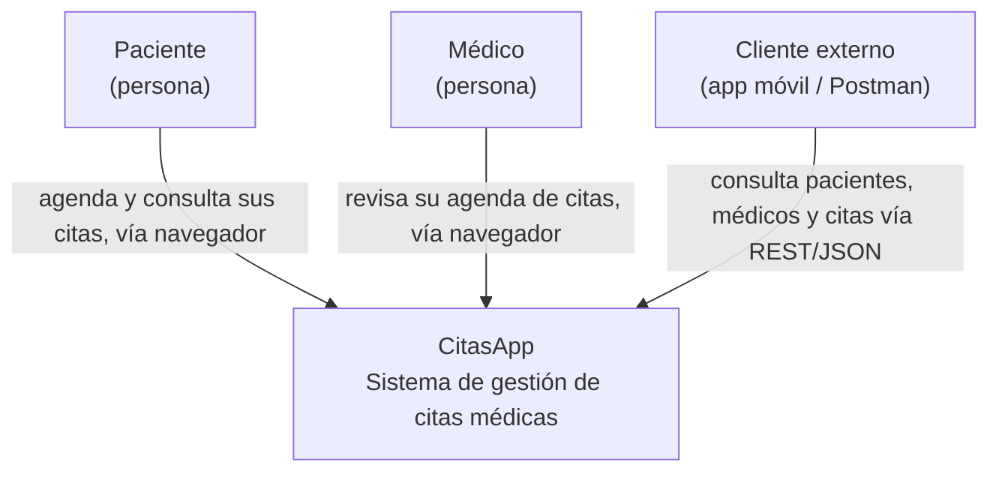

# C4 — Nivel 1: Diagrama de Contexto — CitasApp

**Para quién es:** cualquier persona, técnica o no — un cliente, el maestro, un
nuevo integrante del equipo el primer día. No requiere saber nada de código.

**Qué responde:** ¿qué es el sistema y quién lo usa? Nadie en esta vista
necesita saber que existe .NET, que hay una rama `GOF-Patterns`, ni que
`ConfirmarCita` dispara un Observer — eso es zoom técnico de niveles
posteriores.

## Diagrama

## Notas del estado real (rama `GOF-Patterns`)

- El sistema tiene **dos puertas de entrada** hacia el mismo núcleo: una vista
  navegador (`CitasApp.Web`, MVC con Razor) y una vista REST para clientes
  externos (`CitasApp.Api`, JSON). Por eso aparecen tres actores en vez de uno
  solo — Paciente y Médico llegan por el navegador, y "Cliente externo"
  representa a quien consuma la API (Postman, una futura app móvil, otro
  servicio).
- No hay autenticación ni roles: cualquier persona que abra la app puede ver
  cualquier vista. Eso no se modela aquí porque es una decisión de diseño de
  niveles inferiores, no de contexto.
- Este nivel no cambia aunque el equipo reescriba toda la Infraestructura por
  dentro (Json → base de datos real, por ejemplo) — es la vista más estable
  del sistema.

---

⬅️ [Volver al README de la rama](../README.md) · Siguiente: [C2 — Contenedores](C2-Contenedores.md)
