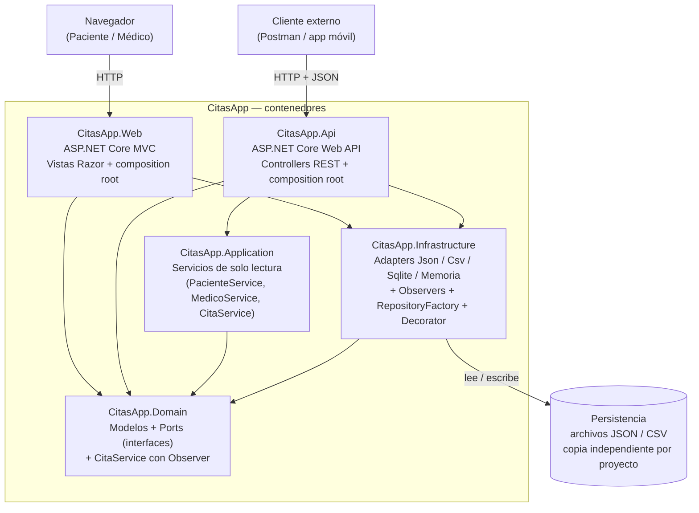

# C4 — Nivel 2: Diagrama de Contenedores — CitasApp

**Para quién es:** el equipo técnico — quien necesita saber de qué piezas
grandes está hecho el sistema antes de tocar código.

**Qué responde:** ¿de qué piezas técnicas se compone CitasApp y cómo se
comunican entre sí?

## Diagrama

## Notas del estado real (rama `GOF-Patterns`)

- **Cinco proyectos, no tres.** La arquitectura hexagonal original
  (`Domain` / `Infrastructure` / `Web`) creció con `Application` (servicios de
  solo lectura) y `Api` (segunda puerta de entrada REST) en la rama `Api`,
  que ya está integrada aquí.
- **`CitasApp.Web` y `CitasApp.Api` son *composition roots* independientes** —
  cada uno tiene su propio `Program.cs` y decide distinto cómo conectar los
  ports con los adapters:
  - `Web` referencia `Domain` + `Infrastructure` directamente (no usa
    `Application`) y consume el `CitaService` de **Domain**, que notifica a
    observadores al confirmar una cita.
  - `Api` referencia las tres capas y consume el `CitaService` de
    **Application**, una versión de solo lectura sin Observer.
- **No hay base de datos real.** La persistencia son archivos `JSON` (leídos
  por `Json*Repository`) y `CSV` (`Csv*Repository`), cada proyecto (`Web`,
  `Api`) con su propia copia de `data/`. Existen adapters `Sqlite*Repository`
  en Infrastructure, pero **no están conectados en ningún `Program.cs`
  actualmente** — no es una pieza viva del sistema hoy.
- Ver el detalle de qué patrón GOF vive dentro de cuál contenedor en el
  siguiente nivel.

---

⬅️ [C1 — Contexto](C1-Contexto.md) · [Volver al README de la rama](../README.md) · Siguiente: [C3 — Componentes](C3-Componentes.md)
