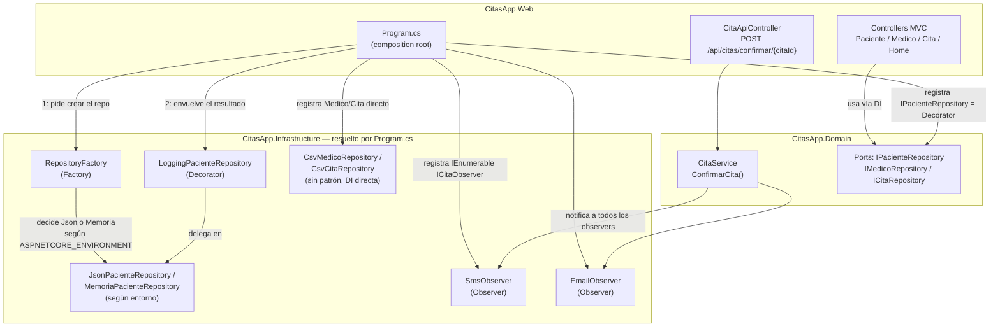

# C4 — Nivel 3: Diagrama de Componentes — dentro de `CitasApp.Web`

**Para quién es:** quien va a modificar código dentro de este contenedor —
principalmente `CitasApp.Web`, que es donde vive la lógica de esta rama.

**Qué responde:** ¿qué piezas hay dentro de `CitasApp.Web` y cómo colaboran?
Este es el nivel donde los patrones GOF de la práctica #26
(**Factory + Decorator + Observer**) quedan documentados.

> Se eligió `CitasApp.Web` como "pieza principal" para este nivel — y no
> `CitasApp.Api` — porque es el único contenedor donde hoy están conectados
> los tres patrones GOF de esta rama. `CitasApp.Api` (ver
> [C2 — Contenedores](C2-Contenedores.md)) resuelve sus repositorios de forma
> directa, sin Factory, Decorator ni Observer.

## Diagrama

## Notas del estado real (rama `GOF-Patterns`)

- **Factory** — `RepositoryFactory.CrearPacienteRepository(entorno, env)`
  decide en tiempo de ejecución qué implementación crear:
  `Production` → `MemoriaPacienteRepository`; cualquier otro entorno →
  `JsonPacienteRepository`. Solo aplica a `Paciente`.
- **Decorator** — `LoggingPacienteRepository` implementa el mismo port
  (`IPacienteRepository`) que el repo que envuelve, agrega logging en consola
  antes/después de cada operación, y delega en `_inner` sin modificarlo. Se
  arma en `Program.cs` envolviendo lo que devuelve el Factory.
- **Observer** — `SmsObserver` y `EmailObserver` implementan `ICitaObserver`
  (definido en Domain) y se registran ambos bajo la misma interfaz. .NET los
  entrega juntos como `IEnumerable<ICitaObserver>` al `CitaService` de
  Domain, que los notifica a todos al confirmar una cita
  (`POST /api/citas/confirmar/{citaId}`, expuesto por `CitaApiController`).
- `Medico` y `Cita` usan adapters CSV (`CsvMedicoRepository`,
  `CsvCitaRepository`) registrados de forma directa, **sin** ninguno de los
  tres patrones — el foco de la práctica fue exclusivamente `Paciente` (y
  `Cita` para el Observer).
- Este diagrama **no** cubre `CitasApp.Api`: ese contenedor no tiene Factory,
  Decorator ni Observer conectados hoy (ver nota en
  [C2 — Contenedores](C2-Contenedores.md)).

---

⬅️ [C2 — Contenedores](C2-Contenedores.md) · [Volver al README de la rama](../README.md)
